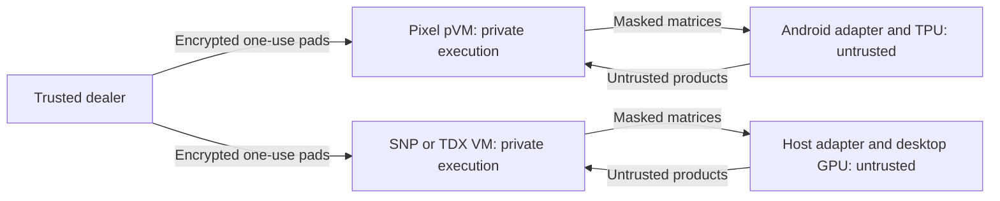

# Shielded: Pixel TPU and confidential server tiers

Design checkpoint, 2026-09-09 Arizona time. This replaces the current phone-to-V100 optimization queue. No new tier has been deployed or benchmarked. Existing production defaults and hardware ownership remain unchanged.

The phone target is the **existing Qwen 3.5 0.8B Q8_0 model**, including its calibrated Shielded representation and trusted graph. The server target remains the existing 27B model, initially preserving its Q8, MTP, vision and configured context requirements. The previously requested Q4_K_M work remains a subsequent server experiment. A small-model result will not be presented as evidence of 27B performance.

## Proposed placement

| Component | Pixel 10 phone tier | Server tier |
|---|---|---|
| Trusted executor | Attested pKVM protected VM | Attested SEV-SNP or TDX VM |
| Untrusted accelerator | Pixel TPU through Android/LiteRT | Desktop GPUs through host worker |
| Private state | Prompt processing, activations, KV state, sampling, pad secrets and verification inside pVM | Same state inside confidential VM |
| Public accelerator inputs | Encoded public weights and masked activation planes | Same |
| Dealer | Trusted external service delivers authenticated, encrypted pads to pVM | Trusted external dealer initially; compare local trusted-CPU generation separately |
| First model | Existing Qwen 3.5 0.8B Q8_0 | Existing 27B Q8/MTP configuration |

The dealer supplies the **trusted executor**, which masks work for the accelerator. It must not hand the TPU or desktop GPU the secret pads. pKVM protects private VM memory; this design does not depend on placing the TPU itself inside the protected VM. Android remains able to interrupt service. A compromised Android input interface can also observe text entered there before it reaches the pVM; protected processing does not establish a trusted keyboard or display. [AOSP security model](https://source.android.com/docs/core/virtualization/security)

## Why the change is worth testing

Local TPU execution removes the phone-to-external-GPU USB/NCM leg. It retains the pVM boundary, masked transfer volume, trusted local operators, verification, and pad replenishment. A local TPU may still spend substantial time waiting for small dependent requests. We must measure the complete pVM-to-TPU exchange, not just TPU kernel throughput.

The server tier removes the phone from the inference critical path altogether. Existing masked-GPU arithmetic can be reused near server CPU cores and memory. Shared host buffers remain untrusted; copy results into private memory before consuming them, validate framing, and retain mathematical verification. TDX explicitly distinguishes protected private memory from host-controlled shared memory. [Linux TDX documentation](https://www.kernel.org/doc/html/latest/arch/x86/tdx.html)

The closed 27B workload needed at least 888.2 MB/s into the phone at a hypothetical sustained 20 tok/s, combining replies and consumed pad values. That exceeded the connected 5 Gb/s USB link's raw bandwidth. Moving the accelerator changes that topology; it does not prove a particular new rate. [Measured byte budget](/home/steven/Documents/Codex/2026-09-07/i-w/outputs/27b-byte-budget.md)

## Pixel feasibility gate

Google documents TPU access through the Tensor SDK beta for the Pixel 10 family. That SDK path is LiteRT **CompiledModel with ahead-of-time compilation**; current Tensor documentation does not offer JIT compilation. Model support and SDK access must be checked for the actual device/build. The older Interpreter delegate page is a different path. [Tensor SDK announcement](https://developers.googleblog.com/google-tensor-sdk-beta-with-litert/), [NPU integration guide](https://developers.google.com/edge/litert/next/npu)

Pixel 8 Pro can also be investigated now through the older public NNAPI API. A standalone unprivileged ADB-shell enumeration on our connected Pixel 8 Pro (Android 16) returned `google-edgetpu`, accelerator type 4, feature level 1000008, driver version 2.0. This establishes driver access. Actual strict-FP32 FULLY_CONNECTED support queries returned false for K32/N8/M2, K1024/N128/M1 and the Qwen-sized K1024/N6144/M1. No accelerator operation executed in those trials. Follow-up quantized and relaxed-FP32 operations compiled and executed successfully. Ten independent relaxed-mode cases, including dense random Qwen-sized matrices, matched exactly; this is empirical evidence for an experimental path, not a general precision guarantee. [Pixel 8 results](/home/steven/Documents/Codex/2026-09-07/i-w/outputs/pixel8-tpu-capability.md) [Probe result](/home/steven/Documents/Codex/2026-09-07/i-w/work/pixel8-nnapi-fc-root-1/result.json) The probe uses `ANeuralNetworksCompilation_createForDevices` with only that device, excluding the CPU reference implementation and NNAPI fallback. [NNAPI device assignment and fallback](https://developer.android.com/ndk/guides/neuralnetworks#device-discovery-and-assignment), [Enumeration receipt](/home/steven/Documents/Codex/2026-09-07/i-w/work/pixel8-nnapi-enumerate-1/receipt.json)

We will keep the existing Qwen graph inside the pVM and replace its masked matmul worker. Its GGUF file does not become a directly executable TPU model. Ahead-of-time worker graphs need the existing encoded public weights and supported batch shapes.

Shielded already represents each masked value as three int8 residue planes, modulo 251, 241 and 239. Encoded weights have magnitude at most 119. The untrusted worker must preserve exact modular products. Ordinary quantized LiteRT fully connected layers return int8 outputs; scaling, rounding and saturation lose the accumulator information required here. An int32 bias field does not imply an int32 output. [LiteRT quantization specification](https://developers.google.com/edge/litert/conversion/tensorflow/quantization/quantization_spec)

Two candidates merit a small capability test:

1. Exact int8 multiplication with an exposed int32 accumulator, followed by public modular reduction.
2. Genuine FP32 partial products with K chunks of at most 1024: `125 × 119 × 1024 = 15,232,000 < 2^24`. All integer products and partial sums are representable under genuine FP32 arithmetic. Reduced-precision internal computation invalidates that reasoning. Google's `no_truncation` compiler option provides a candidate configuration, not proof of hardware behavior. [Compiler options](https://developers.google.com/edge/tensor-sdk/compilation-flags)

The Android adapter can combine partial sums, perform CRT, and pack the same 24-bit replies before returning them to the pVM. This work uses only public or masked values. Extra TPU-to-adapter traffic does not necessarily mean extra traffic across the pVM boundary. Existing verification still decides whether to accept the final result.

## Server integration

Reuse the existing Metal launcher, configfs-TSM evidence producer, SNP verifier, guest agent, and Shielded backend. The repository already contains SNP support and TDX launch/evidence plumbing; they should not be reimplemented as a new stack.

The production admission path needs separate confirmation for each platform. In particular, the current relay attestation branch admits SNP/AVF, so a TDX launch option is not evidence that TDX quote verification is complete. For dealt pads, bind the pad recipient key as well as the transport key and fresh challenge into admitted evidence. Reuse existing signature and one-use mechanisms after verifying those bindings.

Online pad generation inside the confidential VM is an alternative to external delivery, not a free performance improvement. It exchanges shipment bandwidth for trusted CPU matrix multiplication. Compare it after establishing the server baseline. No secret pad computation moves onto an ordinary GPU.

Fresh boot keys help with session separation; they do not alone solve restoration of already-live secret state. Preserve SNP's existing debug/migration restrictions and explicitly account for each platform's permitted restore/migration behavior. Authenticated storage alone does not establish freshness. SNP reports provide measurements, policy and guest-supplied binding data for admission. [AMD attestation description](https://www.amd.com/content/dam/amd/en/documents/epyc-business-docs/white-papers/SEV-SNP-strengthening-vm-isolation-with-integrity-protection-and-more.pdf)

## Validation sequence

The [public probe package](/home/steven/Documents/Codex/2026-09-07/i-w/work/tpu-public-probe-root-3/README.md) is prepared: 11 synthetic cases, 67 host checks passed in 1.523 seconds. Its manifest explicitly records DEVICE_NOT_RUN. Existing Qwen metadata identifies `blk.0.attn_qkv.weight` as K=1024, N=6144, a suitable first model-sized arithmetic probe after the tiny cases pass. Calibration membership alone does not prove runtime offload: placement thresholds and local-site overrides must also be applied.

1. Generate public synthetic matrices and exact reference outputs. Check raw dtype, rounding, saturation, negative values, cancellation, chunk boundaries and repeated execution. Record this as **DEVICE_NOT_RUN** until a TPU actually executes it.
2. First test public NNAPI on the connected Pixel 8 Pro; repeat through the Tensor SDK on Pixel 10 when available. Compile and execute the candidate with evidence that the intended matmuls run on the TPU. CPU/GPU fallback is a failed TPU capability test. Record compilation separately from warm execution, copies and adapter reduction. Bound each test to five minutes, with ten minutes an absolute maximum.
3. Connect one existing Qwen Shielded group through the pVM adapter. Compare exact products with the trusted reference and confirm corrupted replies are refused. Measure the complete exchange cost.
4. Run existing Qwen 3.5 0.8B inference against its trusted CPU reference on the same phone, model, prompt and context. Report model identity, generated tokens, decode and prefill times, MTP acceptance, pad consumption/waits, actual accelerator placement, and sustained replenishment separately from preloaded bursts. Require a measured end-to-end benefit before promoting the TPU path.
5. Establish a 27B server baseline on an admitted confidential VM and the permitted desktop GPUs. A host-only development run may guide transport work but is not an attested server result.

The currently connected device is Pixel 8 Pro. Its TPU driver executed the quantized and relaxed-FP32 probes. Ten relaxed-mode cases matched the exact integer oracle, including dense Qwen-sized matrices. Plain, unshielded Qwen3.5 0.8B generation now works through an experimental NNAPI backend. The latest QKV/gate fusion measured 10.50 generated tok/s versus 9.74 for the matched control across repeated warmed trials, with identical output. It combines 150 projections into 102 calls per decoded token; other operators and prefill remain CPU. Peak observed10.85 is not a sustained-rate guarantee. [Latest fusion evidence](pixel8-qkvgate-fusion.md). Run slowdown still limits sustained-performance claims. Burst execution has not demonstrated a speedup. [Plain TPU baseline](pixel8-qwen08-tpu-baseline.md). Full pVM-to-TPU inference is still unimplemented. No Pixel 10 TPU result is available. The current workstation's previous development runs are not production TEE evidence. The first decision is whether the TPU arithmetic and complete exchange beat the existing path; **20 tok/s remains a target, not a forecast**.
